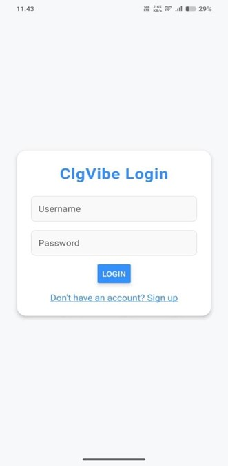
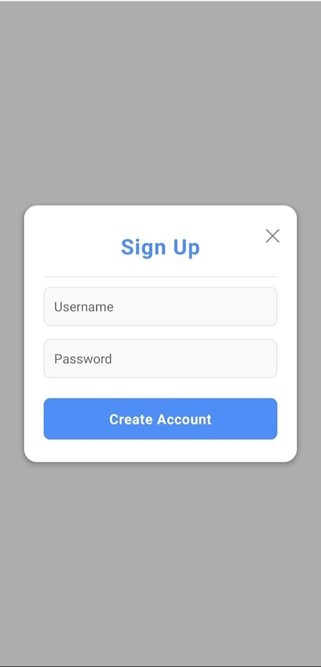
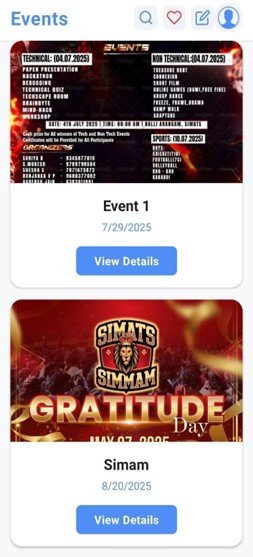
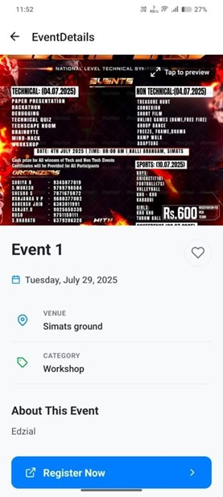
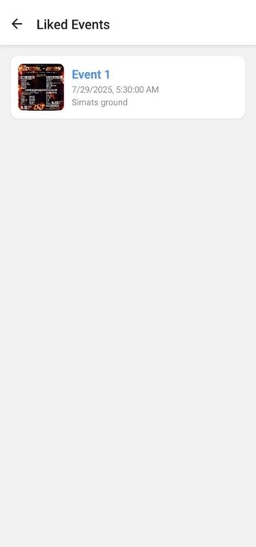
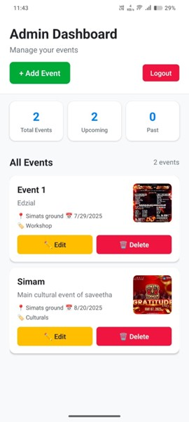
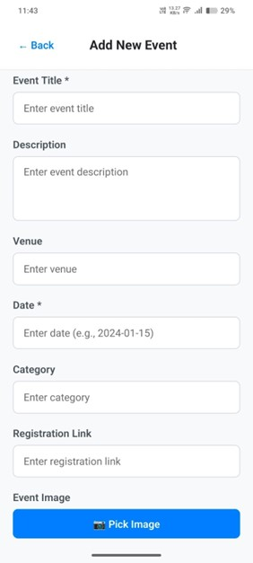

# 📱 ClgVibe – Campus Event Aggregator App

ClgVibe is a mobile application designed to centralize and streamline the management of campus events, helping students stay informed and engaged. It eliminates the confusion of scattered announcements by providing a single, intuitive platform where students can browse all upcoming events, like their favorites, view registered events, and explore detailed event information with posters. Organizers can also manage events through a dedicated admin panel. With secure login and signup, ClgVibe offers a personalized and efficient experience for every user.

---

## 🖼️ App Screenshots

---

### 🔐 Login & Signup

  
  

---

### 🏠 User Dashboard

  
  
  

---

### ⚙️ Admin Dashboard

  
  

## ✨ Features

- 📋 Browse all upcoming campus events in one place  
- ❤️ Like events you’re interested in  
- 🔔 View Registered events 
- 🧑‍💼 Admin panel for event organizers  
- 📷 Poster previews and event details  
- 🔐 Login and signup for personalized experience  

---

## 🛠️ Built With

- **Frontend:** React Native  
- **Backend:** Node.js, Express.js  
- **Database:** MongoDB  
- **Authentication:** JWT  
- **Image Uploads:** Multer  
- **Navigation:** React Navigation  

---

## 📦 Code Availability

This project is currently maintained as private. However, the source code **may be made available upon request** for educational or collaborative purposes.  
Please feel free to [contact the author](https://github.com/akashkrish1010) if you're interested.

---

## 👨‍💻 Author

**Akash Krish**  

---

## 📄 License

Licensed under the **MIT License**.
